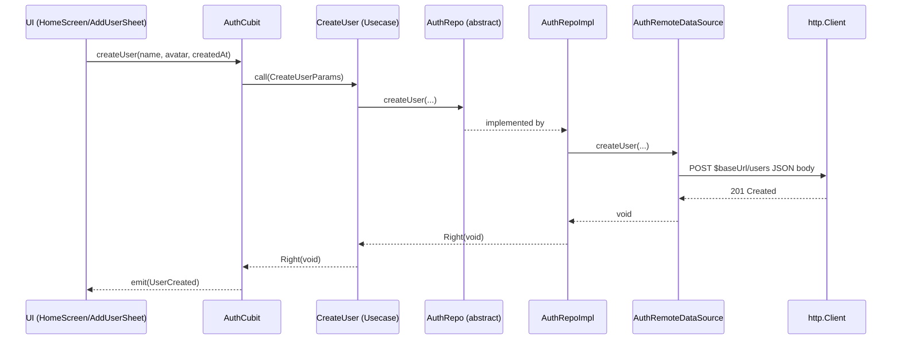
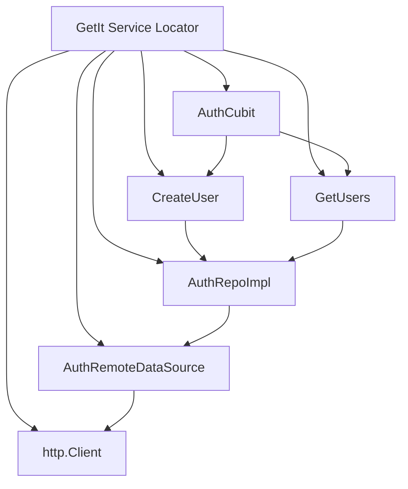

Flutter Clean Architecture With TDD | BLoC | Cubit

Clean architecture helps you maintain your code and it's really suitable for large projects and best for scalability. Flutter beginners get difficult time to understand and implement it. And adding BLoC and Cubit with it makes it more difficult. Take a BLoC and TDD with clear architecture course.

Riverpod Clean Architecture Course

This tutorial is not for beginners. You should have at least 6 months experience in Flutter

Here I am gonna explain step by step to understand Clean architecture and also cover TDD at the end with dependency injection with GetIt. Clean architecture has three layers. This could be your ultimate project or folder structure of Flutter app.

Clean architecture itself follow something called SOLID.

Since we are focusing on Flutter we are going to start with lib folder.


Rest of the folders would reside inside lib/core and lib/src folder. Your core folder would contain the core features of the app written in dart code (mostly) and src folder would contain the screens or pages.

Three layers are Presentation layer, Domain layer and Data layer. Look at the flow and how they communicate.

### Architecture overview

```mermaid
graph LR
  subgraph Presentation
    UI[Views/Widgets]
    SM[State Mgmt (Cubit/BLoC)]
  end
  subgraph Domain
    UC[Usecases]
    ENT[Entities]
    REPO_ABS[Repositories (abstract)]
  end
  subgraph Data
    REPO_IMPL[Repositories (impl)]
    DS[Data Sources]
    NET[HTTP Client]
    MODEL[Models]
  end

  UI --> SM
  SM --> UC
  UC --> REPO_ABS
  REPO_ABS -.implemented by .-> REPO_IMPL
  REPO_IMPL --> DS
  DS --> NET
  DS --> MODEL
  MODEL --> ENT

  classDef layer fill:#f8f9fc,stroke:#cfd8dc,color:#263238;
  class UI,SM,UC,ENT,REPO_ABS,REPO_IMPL,DS,NET,MODEL layer;
```

Key rules:
- Presentation depends on Domain; Domain depends on nothing; Data depends on Domain.
- Domain exposes abstractions; Data implements them.
- Errors are mapped to `Failure` types at the repo boundary.


Domain layer

Domain layer contains the business logic of our application. But this is not BLoC business logic. Strongly suggest to write your code from domain layer.

In general, domain layer works with presentation layer. Domain layer is triggered by an events from presentation layer. These events could be a button press or API calling.

Domain does not depend on anyone. Presentation layer finds domain layer to work with.

First let's a look at this layer and folder structure


Here you can see that have entities, repos and usescases folder. First we should create entities.

Entities in domain layer

Entities hold the blue print of our data model which we will pass around for a certain features or screens or pages.


Entities are necessary when we deal with incoming responses from our server. Server response data has to match with our data model. 

For example, an user's information coming from server has to match in our application. So we create entities to do it. It's like one on one relationship with server repsponse data.

Repositories in domain layer

After that we create repository or repos. Repositories contains abstract classes or interfaces. Dart does not have interfaces, Dart only gives us abstract classes. We will use abstract classes to mimic interfaces.

They are the rules of a particular feature or screen. These classes define what a particular feature should do.


These classes contain methods signature. So the signatue defines what a feature should do. You should also notice that it's an abstract class. It means either we extend or implement this class by others.

Using the repositories we define a contract between domain layer and data layer. In other words because of repositories we can reach from domain layer to the data layer.

If we implement this class by other class, that means all the methods defined in the AuthRepo class must in the other class. All the methods must be defined in the class subclass of AuthRepo, which we will see later. The subclass is AuthRepoImpl.

This is called repository pattern. In repository pattern, we create a layer of abstract between the UI and data layer.

When presentation layer communicates with domain layer, presentation layer first reach out to usecases folder in domain layer.

Usecases in domain layer

From the name it implies that, usecases tells you the features of our application. It means what methods are defined there to create certain app features or functions. 

Usecases depend on repositories. Every usecase in general depends on a repo.


Usecases sub layer contains tunnel between presentation and domain layer. In general, this is only tunnel between presentation layer and domain layer to communicate.


Here you see how we reached out from our AuthBloc to SignIn class. AuthBloc belongs to presentation layer but it reaches for SignIn class in the usecases folder. 

After that usecases reaches to repo which has AuthRepo. AuthRepo is an abstract class and it is implemented by the data layer.

This usecases layer should only contain a class or methods and helper related logic or function.

Usecases layer should be very independent and should not take anything outside of Domain layer.


No error handling happens in domain layer

Data layer

Data layer is for fetching data from outside world or from local storage to app. Data layer depends on domain layer. If you delete domain layer, data layer will get error. But the opposite is not true. In general data layer contains three below folders.

datasources
models
repos


Models in data layer

Models in data layer are like entities. But they have more features. they are the extension of the entities, so we will let our model class to extend our entity. So an entity becomes our parent class for a model.

Models are the ones that we test in TDD. 

In our models in data layer we will have toJson, fromJson, copyWith method like these.

Repositories in data layer

The repos in data layer are also the implimentation of the repos in the domain layer. Why is so? because the repositories in the domain layer are abstruct classes. 

We can not use those abstract classes in directly, we need to someone to take them and extend them. Repositories in the data layer this job of extention or implimentation. 

This is how domain and data layer interact with each other.

The CRUD operations also happen here in the repository of data layer. So this repositories do the actual work of engineering. 

This repositories also depends on the data source of data layer. 

Data layer repos depends on domain layer repos and data source

Data source in data layer

Data source in the data layer creates a link with the outside world. Data source query API, database or even local storage.

These data sources depends on external packages or source like http or sharedpreferences. If you server is firebase, then data source would depend on your firebase instances. 

Since data layer works with external resources and fetch data, it also throws exceptions if necessary. We used dartz package to handle the success or failure.

From the above picture you will see auth_remote_data_source.dart file. This class will contain an abstract class AuthRemoteDataSource as well an implementation of this abstract class name AuthRemoteDataSourceImpl. 


What ever is defined in the domain layer repositories(repos), data layer repositories would implement them. Remember that repos in the domain is all abstract classes. Datasource would be taken from external server or local storage. The exact approach how to reach out to the external source or local storage is defined in the repos of this layer.

Since we are using GetIt for depedency injection, data layer's repos would have the notion of the repos of datasource. 

Error handling happens here

Presentation layer

Presentation layer may include your bloc, views, utils, and widgets. This layer mostly depends on other layer.

How the layer may look like see the picture below


In general, in widgets folder you will put the reusable classes or files. Utils folder contains things like special widgets like styles, colors and things like that.

bloc folder is the most important one. It contains your state, event and bloc. They are at the heart of the state management. 

And views folder actual screen which the users see. And the classes in this folder connects and contains every other classes in the presentation layer.

Ultimately, views file would contain bloc and bloc itself would contain event and state. The bloc would reach out to domain layer first when an user interaction happens.


The above picture should give you how the views inside presentation layer works. Even though it's one way from the arrow, but it should also work the opposite if you receive data from outside world.

In general the bloc in presentation layer would trigger the usecases of domain layer. And then the usecases would trigger the repositories in domain layer to data layer repository. Remember data layer's repositories are the implementation of the domain layer repositories(they are just abstract classes).

And then data layer's repositories would find the data source and get data back to the usecases of domain layer.

Then domain layer would feed data back to the bloc. And bloc will show the data on the view. 


Let's take another look. This might help how you understand the basic flow. The diagram below shows how the basic flow starts from Presentation layer to the domain layer to the data layer (uni-directional).

### Create User flow (end-to-end)



On success the UI closes the sheet, shows a SnackBar, and refreshes the list.


Dependency injection


Here we see how dependency injection also blends into clean architecture pattern. Here we injected from presentation layer to data layer and even to the external storage.

This starts with installing get_it package and then creating an instance of it. We call it sl() or service location. You may call it anything you like.

You should start with BLoC/Cubit/GetX at the top with registerFactory() method. Inside the registerFactory() method you should get your app logic, it means your state management mechanism.

As we initialize app logic(bloc/cubit/getx), we don't pass the dependencies directly, rather we pass the sl(), this service location instance sl() will find the related dependencies.



### Project structure (key parts)

```text
lib/
  core/
    errors/          # Failure
    service/         # GetIt setup
    usecase/         # Base usecase types
    utils/           # typedefs, constants
  src/
    authentication/
      data/
        datasources/ # Remote data source (http)
        models/      # UserModel
        repo/        # AuthRepoImpl
      domain/
        entities/    # User
        repositories/# AuthRepo (abstract)
        usecases/    # CreateUser, GetUsers
      presentation/
        cubit/       # AuthCubit, AuthState
        views/       # HomeScreen
        widgets/     # Sheets, loading, empty state
```

### API endpoints

- baseUrl: `https://68a6fbe7639c6a54e9a090e3.mockapi.io/api/v1`
- POST create user: `POST /users` body: `{ createdAt, name, avatar }`
- GET users: `GET /users`

### How to run

```bash
flutter pub get
flutter run
```

### Code quality

```bash
flutter analyze
```

Notes:
- Unused imports and string interpolation infos can be cleaned gradually.
- Network errors surface as `AuthError` states and are shown via SnackBar.

### Screenshots

Place your screenshots in `assets/readme/` with the following names:

- Home screen


- Users list


- Create user sheet

